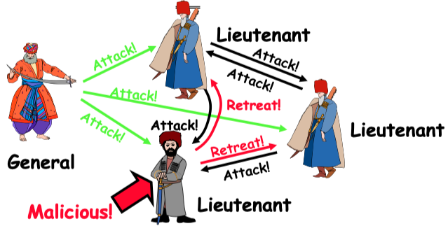
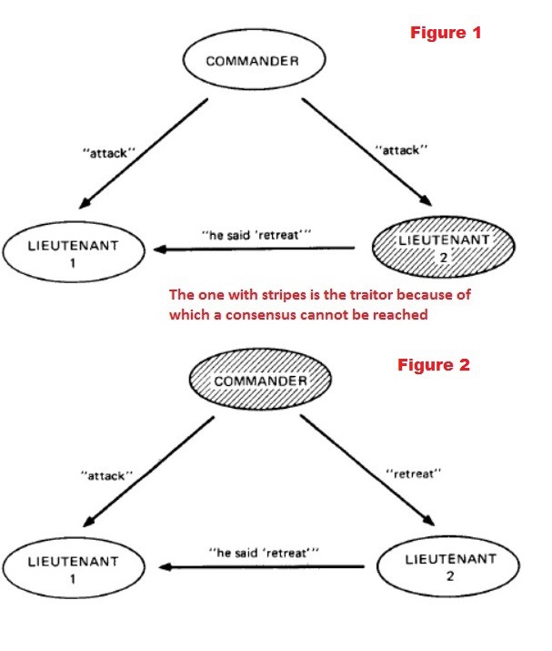

The **CAP theorem**(CAP定理), also named Brewer's theorem after computer scientist Eric Brewer, states that it is impossible for a distributed data store to simultaneously provide more than two out of the following three guarantees:

* *Consistency*(一致性): Every read receives the most recent write or an error
* *Availability*(可用性): Every request receives a (non-error) response, without the guarantee that it contains the most recent write
* *Partition tolerance*(分区容错性): The system continues to operate despite an arbitrary number of messages being dropped (or delayed) by the network between nodes

#### byzantine general's problem
拜占庭将军问题 Leslie Lamport提出

在很久很久以前，拜占庭是东罗马帝国的首都。那个时候罗马帝国国土辽阔，为了防御目的，因此每个军队都分隔很远，将军与将军之间只能靠信使传递消息。在打仗的时候，拜占庭军队内所有将军必需达成一致的共识，才能更好地赢得胜利。但是，在军队内有可能存有叛徒，扰乱将军们的决定。

https://medium.com/all-things-ledger/the-byzantine-generals-problem-168553f31480

* no solution for $> \frac{1}{2}$ traitors
* solution to all remaining cases: practical byzantine fault tolerance

assumptions of fault tolerant systems vs byzantine fault tolerant systems:

* fail-stop: nodes can crash, not return values, crash detectable by other nodes
* byzantine: nodes can do all of the above and send incorrect/corrupted values, corruption or manipulation harder to detect

voting based consesus: 

#### paxos

ref: paxos made simple, lamport

protocol proceeds over several rounds, where each successful round has 2 phases: prepare and accept

1. citizens talk to proposer
2. within Paxon parliament: proposer, acceptor, and learner discuss
    1. pass decrees
    2. a decree has a number and value
3. learner talks to citizens

there is an obvious corespondence between this databases system and the Paxon parliament:

Paxos in practice:

* nodes do not try to subvert the protocol (messages delivered without corruption)
* only works for fail-stop (no Byzantine failures) faults
* failed nodes at any point won't affect the entire network
* good performance (fast)
* generally used to replicate large sets of data

Proposers:

* active: put forth particular values to be chosen
* handle client requests

Acceptors:

* passive: respond to messages from propersers
* responses represent votes that form consensus
* store chosen value, state of the decision process
* want to know which value was chosen
* 

#### raft

https://raft.github.io

raft is another consensus mechanism designed to be an alternative to Paxos

* designed to be more understandable than Paxos
* Leader-based approach
* Easier to implement
* JP Morgan's Quorum: Raft-based consesus

Leader Election

1. Leader sends "heartbeats" to other nodes saying that it is online
2. If other nodes no longer receive "heartbeat", they start an election cycle (and internal timer)
3. First candidate to timeout becomes new leader

Log Replication

1. Leader accepts client request
2. Leader ensures all other nodes have followed that request

Raft的演示 http://thesecretlivesofdata.com/raft/

#### PBFT

https://www.youtube.com/watch?v=M4RW6GAwryc

practical byzantine fault tolerance, Miguel Castro and Barbara Liskov

* Fast
* Handle $f$ byzantine faults in a system with $3f + 1$ nodes
* BFT-NFS only 3% slower than standard unreplicated NFS

preprepare, prepare, commit