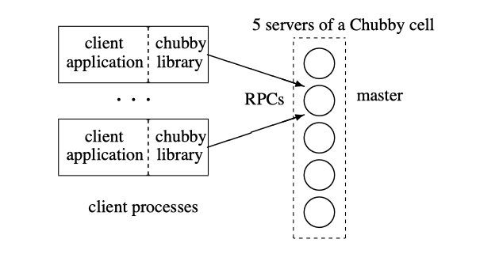

[The Chubby lock service for loosely-coupled distributed systems, Mike Burrows, 2006, Google](https://research.google.com/archive/chubby-osdi06.pdf)

#### Introduction

Chubby lock service provide

* coarse-grained locking
* reliable (though low-volume) storage for a loosely-coupled distributed system.

The purpose of the lock service is to allow its clients to synchronize their activities and to agree on basic information about their environment.

Design emphasis

* Availability
* Reliability
* But not for high performance/ high throughput 

Usage:

* elect a leader from among a set of otherwise equivalent servers
* store a small amount of meta-data

### 2 Design

##### Rationale

#### System Design

Chubby has two main components that communicate via RPC: a server, and a library that client applications link against; All communication between Chubby clients and the servers is mediated by the client library.

*Chubby cell* consists of a small set of servers (typically 5) known as replicas, placed so as to reduce the likelihood of correlated failure (for example, in different racks). The replicas use a distributed consensus protocol to elect a master; the master must obtain votes from a majority of the replicas, plus promises that those replicas will not elect a different master for an interval of a few seconds known as the *master lease*. The master lease is periodically renewed by the replicas provided the master continues to win a majority of the vote

