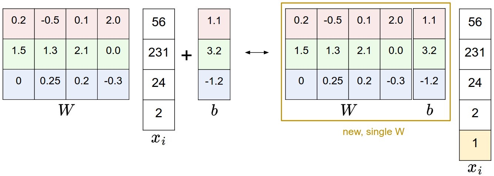
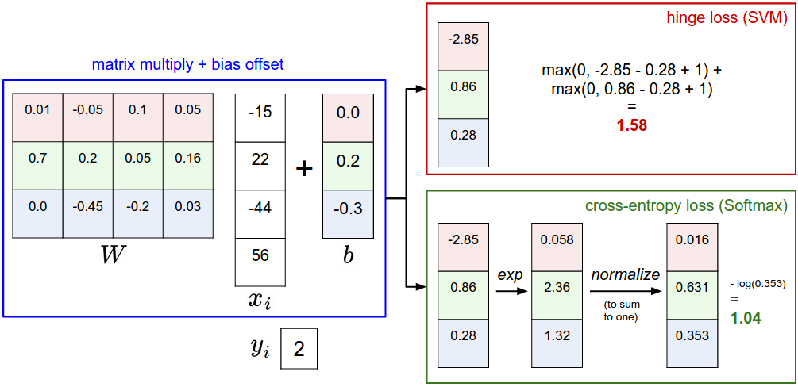

`score function` that maps the raw data to class scores. For visual
recognition, score function maps the pixel values of an image to
confidence scores for each class.

`loss function` that quantifies the agreement between the predicated
scores and the ground truth labels.

**Linear classifier.** We will start out with arguably the simplest
possible function( a `score function`), a linear mapping:

$f(x_i, W, b) = W x_i + b$

Convolutional Neural Networks will map image pixels to scores exactly as
shown above, but the mapping ( $f $ will be more complex and will
contain more parameters.

**Bias trick**: A commonly used trick is to combine the two sets of
parameters $W, b$ into a single matrix that holds both of them by
extending the vector $x_i$ with one additional dimension that
always holds the constant $1$ - a default *bias dimension*. With the
extra dimension, the new `score function` will simplify to a single
matrix multiply:

$f(x_i, W) = W x_i$

**Loss Function**: We want to set parameters W so that the predicted
class scores are consistent with the ground truth labels in the training
data. We are going to measure our unhappiness with outcomes with a
`loss function` (or sometimes also referred to as the `cost function` or
the `objective`). Intuitively, the loss will be high if we're doing a
poor job of classifying the training data, and it will be low if we're
doing well.

-   `Multiclass Support Vector Machine` (SVM): The `score function`
    computes the vector $f(x_i, W)$ of class scores, which we will
    abbreviate to $s$ (short for scores). For example, the score for
    the j-th class is the j-th element: $s_j=f(x_i,W)_j$. The
    Multiclass SVM loss for the i-th example is then formalized as
    follows:

$L_i = \sum_{j\neq y_i} \max(0, s_j - s_{y_i} + \Delta)$
The SVM loss function wants the score of the correct class $y_i$ to
be larger than the incorrect class scores by at least by $\Delta$
(delta). If this is not the case, we will accumulate loss.
Hyperparameter $\Delta$ can safely be set to $\Delta=1.0$ in
all cases

**`hinge loss`**: The function `max(0,1-t)$ is called the`hinge loss\`
function.

**Regularization**:

Including the regularization penalty completes the full Multiclass
Support Vector Machine loss, which is made up of two components: the
**data loss** (which is the average loss $L_i$ over all examples)
and the **regularization loss**. That is, the full Multiclass SVM loss
becomes:

$L = \underbrace{ \frac{1}{N} \sum_i L_i }_\text{data loss} +
\underbrace{ \lambda R(W) }_\text{regularization loss} $

Or expanding this out in its full form:

$L = \frac{1}{N} \sum_i \sum_{j\neq y_i} [ \max(0, f(x_i;
W)_j - f(x_i; W)_{y_i} + \Delta) ] + \lambda
\sum_k\sum_l W_{k,l}^2$

Where $N$ is the number of training examples.

Code. Here is the loss function (without regularization) implemented in
Python, in both unvectorized and half-vectorized form:

**Softmax classifier**: Another commonly seen classifiers besides
`SVM classifier` is the `Softmax classifier`, which has a
`cross-entropy loss`:

$L_i = -\log\left(\frac{e^{f_{y_i}}}{ \sum_j e^{f_j} }\right)
\hspace{0.5in} \text{or equivalently} \hspace{0.5in} L_i =
-f_{y_i} + \log\sum_j e^{f_j}$

where we are using the notation $f_j$ to mean the j-th element of
the vector of class scores $f$. As before, the full loss for the
dataset is the mean of $L_i$ over all training examples together
with a regularization term $R(W)$. The function $f_j(z) =
\frac{e^{z_j}}{\sum_k e^{z_k}} $ is called the **softmax
function**: It takes a vector of arbitrary real-valued scores (in
$z$ and squashes it to a vector of values between zero and one that
sum to one.

The difference between `SVM classifiers` and `Soft-max classifiers`:

