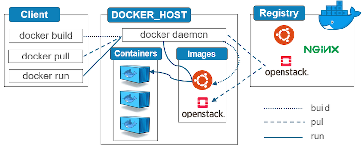
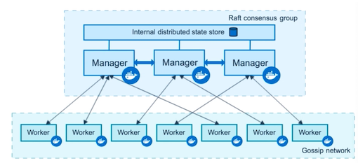
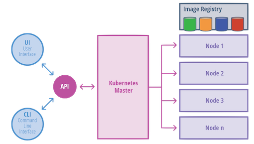
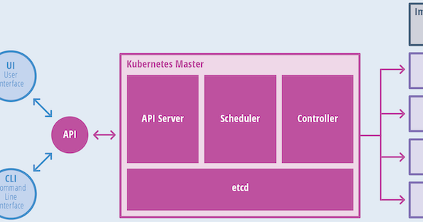
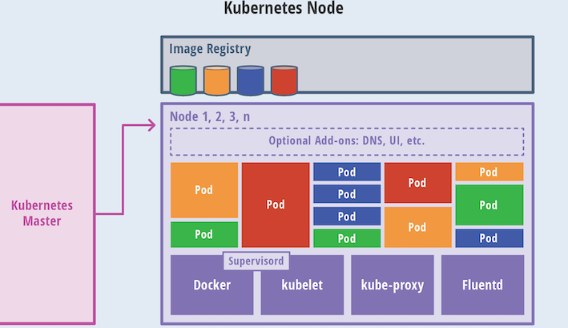
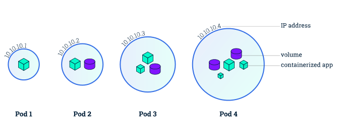
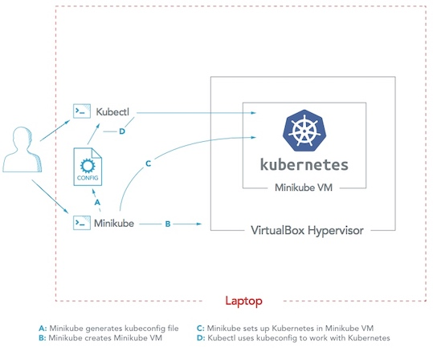

> Docker is a platform for developers and sysadmins to build, run, and share applications with containers.


A container is a standard unit of software that packages up code and all its dependencies so the application runs quickly and reliably from one computing environment to another.  Multiple containers can run on the same machine and share the OS kernel with other containers, each running as isolated processes in user space. 


!!! note "docker v.s. virtual machine"

    
    
    A comparison of the architecture of virtual machines and Docker software containers. Virtual machines are denoted by cyan boxes and software containers are denoted by green boxes. The left stack is a Type-2 virtual machine (VM) which uses a hypervisor to emulate the guest OS(more Virtual Machine [here](18 Virtual Machines.md))). The application software, dependences, and the guest OS are all contained inside the VM. A separate VM, dependencies and guest OS are required for each application stack that is to be deployed. The middle stack depicts Docker container software on a Linux host. Docker uses the host Linux system and packages the application and dependencies into modular containers. No VM is necessary and the OS resources for the two application stacks are shared between different containers. The right stack depicts Docker on a non-Linux system. Because Docker requires Linux, a lightweight VM with a mini-Linux Guest OS is necessary to run Docker and encapsulate the software containers. This still has the advantage that only a single VM and Guest Linux system is required regardless of the number of containers.

### 1 简介
#### Docker Architecture



 

Docker's architecture is client-server based.  It consists of several main parts:

* Client: a user interface for Docker.
* Daemon: a background process responsible for receiving commands and passing them to the containers via command line.
* Images: used to create new containers.
* Containers: standard unit of software that packages up code and all its dependencies.
* Registry: where container images are stored and retrieved.


<!--!!! note "Images v.s. Containers"
    
    Fundamentally, a container is nothing but a running process, with some added encapsulation features applied to it in order to keep it isolated from the host and from other containers. One of the most important aspects of container isolation is that each container interacts with its own private filesystem; this filesystem is provided by a Docker image. An image includes everything needed to run an application - the code or binary, runtimes, dependencies, and any other filesystem objects required.-->


docker底层技术支持

* Namespaces：做隔离pid， net，ipdc， mnt， uts
* Control groups： 做资源限制
* Union file systems： container和image的分层

#### Docker Image/Container

A Docker image is built up from a series of layers. Each layer represents an instruction in the image’s Dockerfile. The major difference between a container and an image is the top writable layer. All writes to the container that add new or modify existing data are stored in this writable layer. When the container is deleted, the writable layer is also deleted. The underlying image remains unchanged.


The metadata is additional information about the layer that allows docker to capture runtime and build-time information, but also hierarchical information on a layer's parent. Additionally, each layer contains a pointer to a parent layer using the Id.


A *running container* is defined as a read-write "union view" and the the isolated process-space and processes within. The below visual shows the read-write container surrounded by this process-space.


The `docker create` command adds a read-write layer to the top stack based on the image id. It does not run this container.


The command `docker start` creates a process space around the union view of the container's layers. There can only be one process space per container. The `docker run` command starts with an image, creates a container, and starts the container (turning it into a running container).


The `docker commit` command takes a container's top-level read-write layer and burns it into a read-only layer. This effectively turns a container (whether running or stopped) into an immutable image.


The `docker build` command uses the `FROM` directive in the Dockerfile file as the starting image and iteratively 1) runs (create and start) 2) modifies and 3) commits.


其他命令可以参见[这里](http://merrigrove.blogspot.com/2015/10/visualizing-docker-containers-and-images.html)。

#### Dockerfile

使用Dockerfile可以用来创建镜像。

```bash
docker build -t zhen/centos .
"."表示使用当前目录的Dockerfile来创建镜像，zhen/centos就是镜像的名字
```


下面是Dockerfile的语法及示例。

##### FROM

尽量使用官方镜像作为base image

```
FROM scratch #制作base image，不依靠别的镜像
FROM centos #使用base image
FROM ubuntu:14.04 #使用base image
```

##### LABEL

设置Metadata

```
LABEL maintainer="xiaoquwl@gmail.com"
LABEL version="1.0"
LABEL description="This is description"
```

##### RUN

run命令为了美观，最好使用反斜杠换行。每运行一次run，image都会生成新的一层，所以尽量合并多条命令成为一行

```
# 使用反斜杠换行
RUN yum update && yum install -y vim \
    python-dev   
# 主要清理cache
RUN apt-get update && apt-get install -y perl \
    pwgen --no-install-recommends && rm -rf \
    /var/lib/apt/lists/*
```

##### WORKDIR

能用WORKDIR的就用WORKDIR，不要用RUN去运行cd命令。
WORKDIR后面跟的路径也可以尽量使用绝对路径

```
# 切换到/root路径
WORKDIR /root
# 如果没有会自动创建test文件夹
WORKDIR /test 
WORKDIR demo
# 输出结果是/test/demo
RUN pwd
```

##### ADD and COPY


* 使用COPY指令，源文件的各种元数据都会保留。比如读、写、执行权限、文件变更时间等。这个特性对于镜像定制很有用。
* ADD指令会自动将压缩文件解压缩添加到目标目录中去

```
# 把hello这个可执行文件添加到/路径下
ADD hello /
# 添加到根目录下并且解压test.tar.gz
ADD test.tar.gz /
# 文件应该是在/root/test/hello
WORKDIR /root
ADD hello test/
# copy版本
WORKDIR /root
COPY hello test/
```

##### ENV

使用ENV可以增加可维护性

```
# 设置ENV
ENV MYSQL_VERSION 5.6
ENV MYSQL_VERSION=5.6 JAVA_HOME=/usr/local/share/jdk1.8/bin
# 使用ENV
RUN apt-get install -y mysql-server= "${MYSQL_VERSION}" \
    && rm -rf /var/lib/apt/lists/*
```

##### RUN CMD ENTRYPOINT

* RUN：执行命令并创建新的Image Layer
* CMD：设置容器启动后默认执行的命令和参数
    * 如果docker run指定了其他命令，会被忽略
    * 如果定义了多个CMD，只有最后一个会执行
* ENTRYPOINT：设置容器启动时运行的命令
    * 不会被忽略，一定会执行

```
RUN apt-get install -y vim
CMD echo "hello docker"
ENTRYPOINT echo "hello docker"
```

#### 操作容器

`docker run`新建并启动容器

```bash
# 启动一个bash 终端，允许用户进行交互。
docker run -t -i ubuntu:18.04 /bin/bash
# -t 选项让Docker分配一个伪终端（pseudo-tty）并绑定到容器的标准输入上 
# -i 则让容器的标准输入保持打开
```

可以利用`docker container start`命令，直接将一个已经终止的容器启动运行。使用`docker container stop`命令来终止一个运行中的容器。

可以使用`docker attach`命令或者`docker exec`命令进入容器。

```bash
docker run -dit ubuntu
docker attach fffb421bc528
docker exec -it  fffb421bc528 bash
```

当从`docker attach`中退出时，会导致容器的终止。所以推荐使用`docker exec`命令。

可以使用`docker container rm`删除一个处于终止状态的容器。或者使用`docker container prune`清理所有处于终止状态的容器。

####  持久化存储

容器写的数据只是在容器中。如果删除容器，则数据也会丢失。Docker持久化存储数据有以下两种方案：

* 数据卷(Volumes)
* 挂载主机目录(Bind mounts)

##### 数据卷

数据卷是一个可供一个可供一个或多个容器使用的特殊目录，它绕过UFS，可以提供很多有用的特性：

* 数据卷可以在容器之间共享和重用
* 对数据卷的修改会立马生效
* 对数据卷的更新不会影响景象
* 数据卷默认会一直存在，即使容器被删除

数据卷可以在Dockerfile中使用VOLUME指定，也可以在启动container时指定

```bash
# Dockerfile
VOLUME /var/lib/mysql
# mysql是volume的name， /var/lib/mysql是volume的路径
docker run -d -v mysql:/var/lib/mysql mysql \
    -e MYSQL_ROOT_PASSWORD='root' mysql
# 生成volume，并挂载
docker volume create mysql
docker run -d --mount source=mysql,target=/var/lib/mysql  \
    -e MYSQL_ROOT_PASSWORD='root' mysql
```

使用`docker volume rm`手动删除卷，或者使用`docker volume prune`清理没有容器使用的数据卷。

##### 挂载主机目录

也可以使用Bind Mounting的方式，使本地目的和容器目录同步

```bash
# /home/mysql是本机路径，/root/mysql是容器路径
docker run -d -v /home/mysql:/root/mysql \
    -e MYSQL_ROOT_PASSWORD='root' mysql
docker run -d --mount type=bind,source=/home/mysql,target=/root/mysql \
    -e MYSQL_ROOT_PASSWORD='root' mysql
```


#### Docker Network

##### 容器的端口映射

可以通过-p参数来指定端口映射。

```
docker run --name web -d -p 80:80 nginx
docker run --name web -d -p 127.0.0.1:80:80 nginx

```

这样在docker容器启动起来之后，我们在本机curl 127.0.0.1，访问的就是docker容器里面的nginx。使用`docker port`命令查看端口映射

```bash
$  /home/docker docker port web
80/tcp -> 0.0.0.0:80
```

##### docker link

```bash
# 创建test1容器
docker run -d --name test1 busybox \
    /bin/sh -c "while true; do sleep 3600; done"
# 创建test2容器，link到test1
docker run -d --name test2 --link test1 busybox \
    /bin/sh -c "while true; do sleep 3600; done"
# test1，test2互相ping对方的ip，是可以ping通的
docker exec test1 ping 172.17.0.3
docker exec test2 ping 172.17.0.2
# 在test2里ping test1
docker run exec test2 ping test1
```


### 2 Docker Compose

Docker Compose可以实现对Docker容器集群的快速编排。它允许用户通过一个单独的模版文件(`docker-compose.yml`)来定义一组相关联的应用容器为一个项目。使用Docker Compose一般分三步：

* 定义Dockerfile
* 定义`docker-compose.yml`
    * 指定project
    * 指定service
* 使用`docker-compose up`启动并运行

```python tab="app.py"
from flask import Flask
from redis import Redis
app = Flask(__name__)
redis = Redis(host='redis', port=6379)

@app.route('/')
def hello():
    count = redis.incr('hits')
    return 'Hello World! 该页面已被访问 {} 次。\n'.format(count)

if __name__ == "__main__":
    app.run(host="0.0.0.0", debug=True)
```

```text tab="Dockerfile"
FROM python:3.6-alpine
ADD . /code
WORKDIR /code
RUN pip install redis flask
CMD ["python", "app.py"]
```

```yml tab="docker-compose.yml"
version: '3'
services:
    web:
        build: .
        ports:
            - "5000:5000"
    redis:
        image: "redis:alpine"
```

使用`docker compose build`构建项目中的容器，使用`docker compose down`停止容器。


#### Docker Swarm




### 3 Kubenetes

[Kubenetes](https://kubernetes.io/zh/)是用于自动部署，扩展和管理容器化应用程序的开源系统。


K8s包括一个Master节点和多个Node节点[^1]。



Master节点负责暴露API，调度、管理



Node节点负责计算、网络、存储资源



#### pod

> A pod is a collection of one or more containers. The pod serves as Kubernetes’ core unit of management. Pods act as the logical boundary for containers sharing the same context and resources. The grouping mechanism of pods make up for the differences between containerization and virtualization by making it possible to run multiple dependent processes together. At runtime, pods can be scaled by creating replica sets, which ensure that the deployment always runs the desired number of pods.

[^2]

Pod是资源调度的最小单位，而不是container。


### 4 底层实现

Docker 底层的核心技术包括 Linux 上的命名空间（Namespaces）、控制组（Control groups）、Union 文件系统（Union file systems）和容器格式（Container format）。

我们知道，传统的虚拟机通过在宿主主机中运行 hypervisor 来模拟一整套完整的硬件环境提供给虚拟机的操作系统。虚拟机系统看到的环境是可限制的，也是彼此隔离的。
这种直接的做法实现了对资源最完整的封装，但很多时候往往意味着系统资源的浪费。
例如，以宿主机和虚拟机系统都为 Linux 系统为例，虚拟机中运行的应用其实可以利用宿主机系统中的运行环境。

我们知道，在操作系统中，包括内核、文件系统、网络、PID、UID、IPC、内存、硬盘、CPU 等等，所有的资源都是应用进程直接共享的。
要想实现虚拟化，除了要实现对内存、CPU、网络IO、硬盘IO、存储空间等的限制外，还要实现文件系统、网络、PID、UID、IPC等等的相互隔离。
前者相对容易实现一些，后者则需要宿主机系统的深入支持。

随着 Linux 系统对于命名空间功能的完善实现，程序员已经可以实现上面的所有需求，让某些进程在彼此隔离的命名空间中运行。大家虽然都共用一个内核和某些运行时环境（例如一些系统命令和系统库），但是彼此却看不到，都以为系统中只有自己的存在。这种机制就是容器（Container），利用命名空间来做权限的隔离控制，利用 cgroups 来做资源分配。

#### 基本架构

Docker 采用了 `C/S` 架构，包括客户端和服务端。Docker 守护进程 （`Daemon`）作为服务端接受来自客户端的请求，并处理这些请求（创建、运行、分发容器）。

客户端和服务端既可以运行在一个机器上，也可通过 `socket` 或者 `RESTful API` 来进行通信。


Docker 守护进程一般在宿主主机后台运行，等待接收来自客户端的消息。

Docker 客户端则为用户提供一系列可执行命令，用户用这些命令实现跟 Docker 守护进程交互。

#### 命名空间

命名空间是 Linux 内核一个强大的特性。每个容器都有自己单独的命名空间，运行在其中的应用都像是在独立的操作系统中运行一样。命名空间保证了容器之间彼此互不影响。

##### pid 命名空间

不同用户的进程就是通过 pid 命名空间隔离开的，且不同命名空间中可以有相同 pid。所有的 LXC 进程在 Docker 中的父进程为 Docker 进程，每个 LXC 进程具有不同的命名空间。同时由于允许嵌套，因此可以很方便的实现嵌套的 Docker 容器。

##### net 命名空间

有了 pid 命名空间，每个命名空间中的 pid 能够相互隔离，但是网络端口还是共享 host 的端口。网络隔离是通过 net 命名空间实现的， 每个 net 命名空间有独立的 网络设备，IP 地址，路由表，/proc/net 目录。这样每个容器的网络就能隔离开来。Docker 默认采用 veth 的方式，将容器中的虚拟网卡同 host 上的一 个Docker 网桥 docker0 连接在一起。

##### ipc 命名空间

容器中进程交互还是采用了 Linux 常见的进程间交互方法(interprocess communication - IPC)， 包括信号量、消息队列和共享内存等。然而同 VM 不同的是，容器的进程间交互实际上还是 host 上具有相同 pid 命名空间中的进程间交互，因此需要在 IPC 资源申请时加入命名空间信息，每个 IPC 资源有一个唯一的 32 位 id。

##### mnt 命名空间
类似 chroot，将一个进程放到一个特定的目录执行。mnt 命名空间允许不同命名空间的进程看到的文件结构不同，这样每个命名空间 中的进程所看到的文件目录就被隔离开了。同 chroot 不同，每个命名空间中的容器在 /proc/mounts 的信息只包含所在命名空间的 mount point。

##### uts 命名空间
UTS("UNIX Time-sharing System") 命名空间允许每个容器拥有独立的 hostname 和 domain name， 使其在网络上可以被视作一个独立的节点而非 主机上的一个进程。

##### user 命名空间

每个容器可以有不同的用户和组 id， 也就是说可以在容器内用容器内部的用户执行程序而非主机上的用户。

*注：更多关于 Linux 上命名空间的信息，请阅读 [这篇文章](https://blog.scottlowe.org/2013/09/04/introducing-linux-network-namespaces/)。


#### 控制组

控制组（[cgroups](https://en.wikipedia.org/wiki/Cgroups)）是 Linux 内核的一个特性，主要用来对共享资源进行隔离、限制、审计等。只有能控制分配到容器的资源，才能避免当多个容器同时运行时的对系统资源的竞争。

控制组技术最早是由 Google 的程序员在 2006 年提出，Linux 内核自 2.6.24 开始支持。

控制组可以提供对容器的内存、CPU、磁盘 IO 等资源的限制和审计管理。
#### 联合文件系统

联合文件系统（[UnionFS](https://en.wikipedia.org/wiki/UnionFS)）是一种分层、轻量级并且高性能的文件系统，它支持对文件系统的修改作为一次提交来一层层的叠加，同时可以将不同目录挂载到同一个虚拟文件系统下(unite several directories into a single virtual filesystem)。

联合文件系统是 Docker 镜像的基础。镜像可以通过分层来进行继承，基于基础镜像（没有父镜像），可以制作各种具体的应用镜像。

另外，不同 Docker 容器就可以共享一些基础的文件系统层，同时再加上自己独有的改动层，大大提高了存储的效率。

Docker 中使用的 AUFS（Advanced Multi-Layered Unification Filesystem）就是一种联合文件系统。 `AUFS` 支持为每一个成员目录（类似 Git 的分支）设定只读（readonly）、读写（readwrite）和写出（whiteout-able）权限, 同时 `AUFS` 里有一个类似分层的概念, 对只读权限的分支可以逻辑上进行增量地修改(不影响只读部分的)。

Docker 目前支持的联合文件系统包括 `OverlayFS`, `AUFS`, `Btrfs`, `VFS`, `ZFS` 和 `Device Mapper`。

各 Linux 发行版 Docker 推荐使用的存储驱动如下表。

|Linux 发行版 |	Docker 推荐使用的存储驱动 |
| :--        | :--                     |
|Docker CE on Ubuntu |	`overlay2` (16.04 +) |
|Docker CE on Debian |	`overlay2` (Debian Stretch), `aufs`, `devicemapper` |
|Docker CE on CentOS |	`overlay2`  |
|Docker CE on Fedora |	`overlay2`  |

在可能的情况下，[推荐](https://docs.docker.com/storage/storagedriver/select-storage-driver/) 使用 `overlay2` 存储驱动，`overlay2` 是目前 Docker 默认的存储驱动，以前则是 `aufs`。你可以通过配置来使用以上提到的其他类型的存储驱动。
#### 容器格式

最初，Docker 采用了 `LXC` 中的容器格式。从 0.7 版本以后开始去除 LXC，转而使用自行开发的 [libcontainer](https://github.com/docker/libcontainer)，从 1.11 开始，则进一步演进为使用 [runC](https://github.com/opencontainers/runc) 和 [containerd](https://github.com/containerd/containerd)。

对更多容器格式的支持，还在进一步的发展中。
####  Docker 网络实现

Docker 的网络实现其实就是利用了 Linux 上的网络命名空间和虚拟网络设备（特别是 veth pair）。建议先熟悉了解这两部分的基本概念再阅读本章。

##### 基本原理
首先，要实现网络通信，机器需要至少一个网络接口（物理接口或虚拟接口）来收发数据包；此外，如果不同子网之间要进行通信，需要路由机制。

Docker 中的网络接口默认都是虚拟的接口。虚拟接口的优势之一是转发效率较高。
Linux 通过在内核中进行数据复制来实现虚拟接口之间的数据转发，发送接口的发送缓存中的数据包被直接复制到接收接口的接收缓存中。对于本地系统和容器内系统看来就像是一个正常的以太网卡，只是它不需要真正同外部网络设备通信，速度要快很多。

Docker 容器网络就利用了这项技术。它在本地主机和容器内分别创建一个虚拟接口，并让它们彼此连通（这样的一对接口叫做 `veth pair`）。

##### 创建网络参数
Docker 创建一个容器的时候，会执行如下操作：

* 创建一对虚拟接口，分别放到本地主机和新容器中；
* 本地主机一端桥接到默认的 docker0 或指定网桥上，并具有一个唯一的名字，如 veth65f9；
* 容器一端放到新容器中，并修改名字作为 eth0，这个接口只在容器的命名空间可见；
* 从网桥可用地址段中获取一个空闲地址分配给容器的 eth0，并配置默认路由到桥接网卡 veth65f9。

完成这些之后，容器就可以使用 eth0 虚拟网卡来连接其他容器和其他网络。

可以在 `docker run` 的时候通过 `--net` 参数来指定容器的网络配置，有4个可选值：

* `--net=bridge` 这个是默认值，连接到默认的网桥。
* `--net=host` 告诉 Docker 不要将容器网络放到隔离的命名空间中，即不要容器化容器内的网络。此时容器使用本地主机的网络，它拥有完全的本地主机接口访问权限。容器进程可以跟主机其它 root 进程一样可以打开低范围的端口，可以访问本地网络服务比如 D-bus，还可以让容器做一些影响整个主机系统的事情，比如重启主机。因此使用这个选项的时候要非常小心。如果进一步的使用 `--privileged=true`，容器会被允许直接配置主机的网络堆栈。
* `--net=container:NAME_or_ID` 让 Docker 将新建容器的进程放到一个已存在容器的网络栈中，新容器进程有自己的文件系统、进程列表和资源限制，但会和已存在的容器共享 IP 地址和端口等网络资源，两者进程可以直接通过 `lo` 环回接口通信。
* `--net=none` 让 Docker 将新容器放到隔离的网络栈中，但是不进行网络配置。之后，用户可以自己进行配置。

##### 网络配置细节

用户使用 `--net=none` 后，可以自行配置网络，让容器达到跟平常一样具有访问网络的权限。通过这个过程，可以了解 Docker 配置网络的细节。

首先，启动一个 `/bin/bash` 容器，指定 `--net=none` 参数。
```bash
$ docker run -i -t --rm --net=none base /bin/bash
root@63f36fc01b5f:/#
```
在本地主机查找容器的进程 id，并为它创建网络命名空间。
```bash
$ docker inspect -f '{{.State.Pid}}' 63f36fc01b5f
2778
$ pid=2778
$ sudo mkdir -p /var/run/netns
$ sudo ln -s /proc/$pid/ns/net /var/run/netns/$pid
```
检查桥接网卡的 IP 和子网掩码信息。
```bash
$ ip addr show docker0
21: docker0: ...
inet 172.17.42.1/16 scope global docker0
...
```
创建一对 “veth pair” 接口 A 和 B，绑定 A 到网桥 `docker0`，并启用它
```bash
$ sudo ip link add A type veth peer name B
$ sudo brctl addif docker0 A
$ sudo ip link set A up
```
将B放到容器的网络命名空间，命名为 eth0，启动它并配置一个可用 IP（桥接网段）和默认网关。
```bash
$ sudo ip link set B netns $pid
$ sudo ip netns exec $pid ip link set dev B name eth0
$ sudo ip netns exec $pid ip link set eth0 up
$ sudo ip netns exec $pid ip addr add 172.17.42.99/16 dev eth0
$ sudo ip netns exec $pid ip route add default via 172.17.42.1
```
以上，就是 Docker 配置网络的具体过程。

当容器结束后，Docker 会清空容器，容器内的 eth0 会随网络命名空间一起被清除，A 接口也被自动从 `docker0` 卸载。

此外，用户可以使用 `ip netns exec` 命令来在指定网络命名空间中进行配置，从而配置容器内的网络。


### 附录

#### 安装

##### docker machine

在mac上使用docker-machine安装比较方便

```bash
# 创建包含docker的虚拟机
docker-machine create -d "virtualbox" --virtualbox-no-vtx-check \
--engine-install-url https://github.com/boot2docker/boot2docker/releases/download/v19.03.5/boot2docker.iso \
--virtualbox-cpu-count "6" \
--virtualbox-disk-size "50000" \
--virtualbox-memory "10240" \
default
# 配置环境变量
eval $(docker-machine env)
# 查看是否已经连接docker server
docker version
# 连接虚拟机
docker-machine ssh default
```

##### Centos

以Centos7为例。

```bash
# Install required packages. 
sudo yum install -y git vim gcc glibc-static telnet bridge-utils net-tools
# 安装
curl -fsSL get.docker.com -o get-docker.sh
sh get-docker.sh
# 添加用户user到用户组
sudo usermod -aG docker user
# 启动docker
sudo systemctl start docker
# 查看安装状态
docker version
```

当然，也创建Docker之后，也可以使用docker-machine来管理：

```bash
docker-machine create \
    --driver generic \
    --generic-ip-address=192.168.56.110 \
    --generic-ssh-key ~/.ssh/id_rsa \
    vm
```

##### 镜像

由于Docker镜像服务器部署在国外，启动国内的镜像加速器可以加快Docker镜像下载速度。在`/etc/docker/daemon.json`中写入如下内容

```json
{
  "registry-mirrors": [
    "https://dockerhub.azk8s.cn",
    "https://hub-mirror.c.163.com"
  ]
}
```

之后重启docker(命令`sudo systemctl restart docker`)。

#### Docker Compose

https://liguoqinjim.com/post/docker/系统学习docker-践行devops理念-笔记二/

#### Minikube

https://my.oschina.net/u/228832/blog/3079150




```bash
# 下载kubectl： https://kubernetes.io/docs/tasks/tools/install-kubectl/#install-kubectl-on-linux
# 下载minicube
curl -Lo minikube http://kubernetes.oss-cn-hangzhou.aliyuncs.com/minikube/releases/v1.2.0/minikube-linux-amd64 && chmod +x minikube && mv minikube /usr/bin/
# --vm-driver=none使用容器，其他可以选择virtualbox等
minikube start -p kube1 --vm-driver=none --registry-mirror=https://registry.docker-cn.com --no-vtx-check

# 查看信息
kubectl config view # 配置
kubectl cluster-info # 集群信息
kubectl get pods # 查看pods
kubectl get pods -o wide   # 获取pod的更多信息，比如在哪台k8s机器上
kubectl describe pod <pod>   #获取一个POD的详细信息
kubectl exec <pod> <cmd>     #在pod里的container里执行一个命令，如果这个pod有多个container，默认会在第一个里执行，或者通过-c去指定哪个
```


[^1]: https://thenewstack.io/kubernetes-an-overview/
[^2]: https://medium.com/developerworld/pod-vs-node-in-kubernetes-26c858988f94