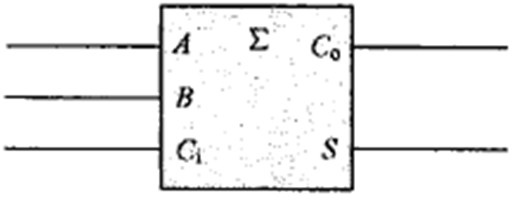
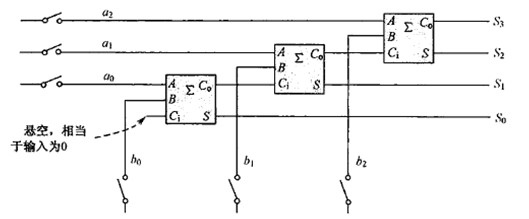
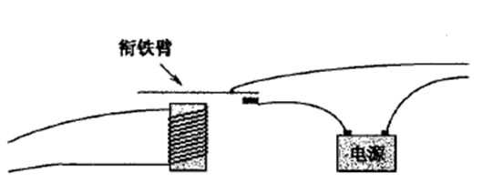
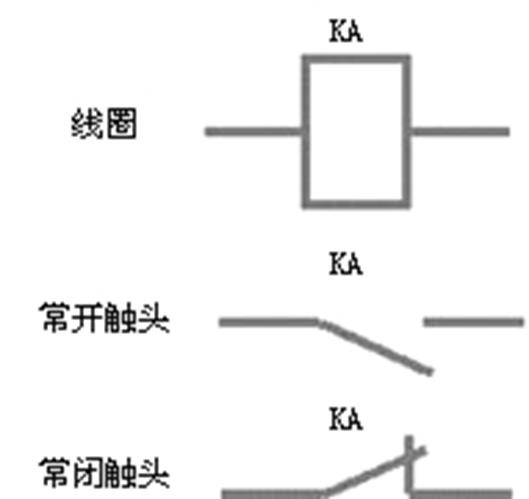

“这个器件的名称是“全加器”，这不是一个很容易理解的名字，特别是这个“全”字，而且，既然是全加器，是不是还应该有“半”加器？还真有半加器这东西。但半加器仅仅是把来自被加数和加数的两个比特加起来，产生和、进位，并不考虑从其他列来的进位。换句话说，它只是用电路来实现二进制加法口诀，全加器则不然，它真正实现了二进制加法中每一列的加法过程，所以它才叫“全加器”

有了全加器，解决了二进制加法过程中每一列的计算问题，那么，我们可以组装一大堆全加器，根据被加数和加数的比特数，把它们串联起来组成一个完整的加法电路
图中，参与相加的两个二进制数分别是a_2 a_1 a_0 和b_2 b_1 b_0 ，组成它们的每一个比特可以用开关的闭合与断开来得到。

继电器（electric relay）。继电器顾名思义是给线路续电的，也就是说，当线路上电流过小的时候，适时补充。它的主体是一个电磁铁，不过衔铁臂下面多了一个金属触点，现在，分别从衔铁臂和金属触点上引出两根线，并串接一个电源，把这两根线作为另外一条电报线路架设到其他地方，注意，电源并不是继电器的组成部分

继电器的符号如下图：

图中的方框代表电磁铁，而在下面紧挨着它的是一个衔铁开关，同时，图中也表明了继电器实际上可以按工作状态分为两种：常开触头平时处于断开状态，只有电磁铁加电时才吸合接通；常闭触头正好相反

“摩尔斯发明的是一种称为电报机的东西，由不在一个地方的两个装置组成，用很长的电线连接起来，如图4.2所示”

把逻辑学和数学结合起来创立了数理逻辑，这个人是乔治·布尔

同时，他还借用了数学里面的一些运算符，如＋，×表示概念和命题之间的逻辑关系，×表示两个集合相交，+表示合并两个集合，

布尔把逻辑学和数学结合起来开创了数理逻辑，香农把布尔代数（逻辑代数）和电学结合起来，开创了一个新的领域：开关电路。

